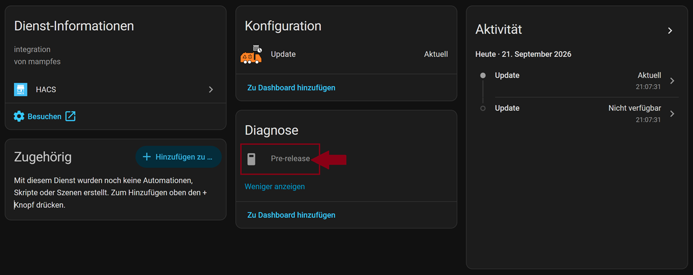
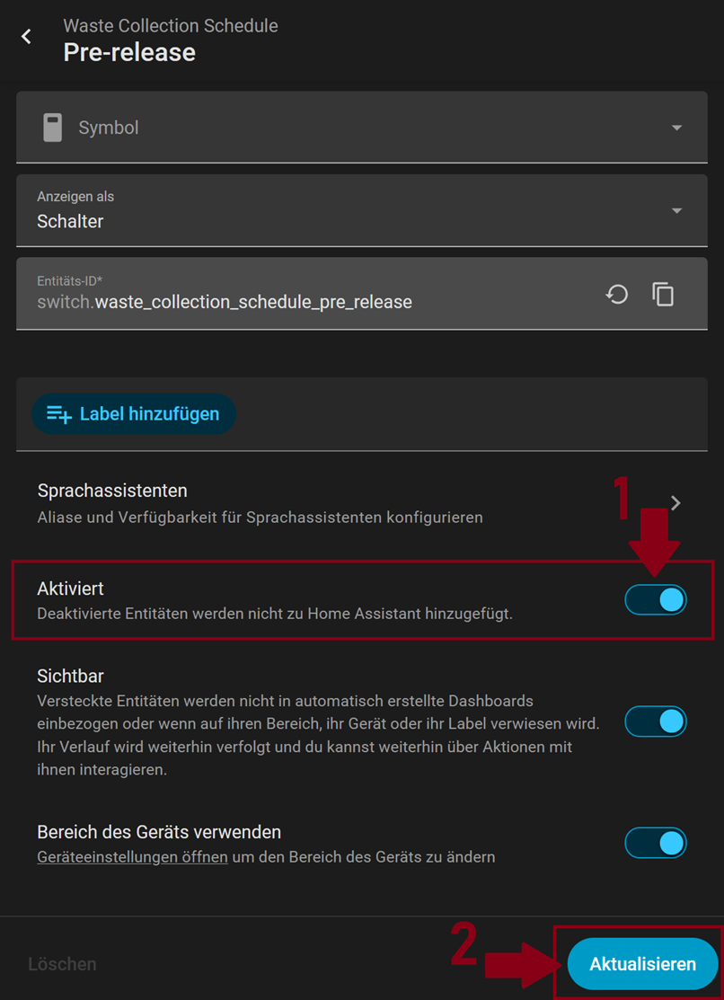
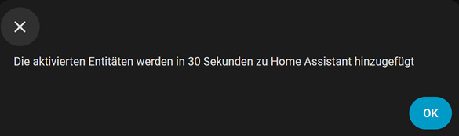
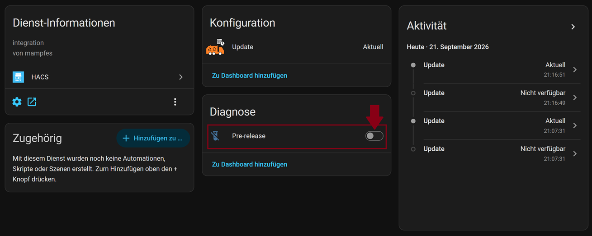
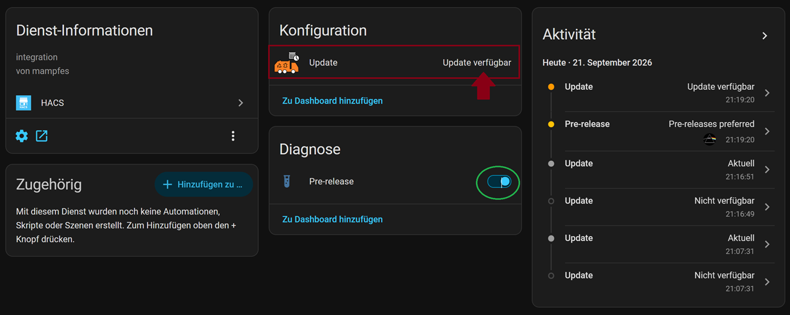
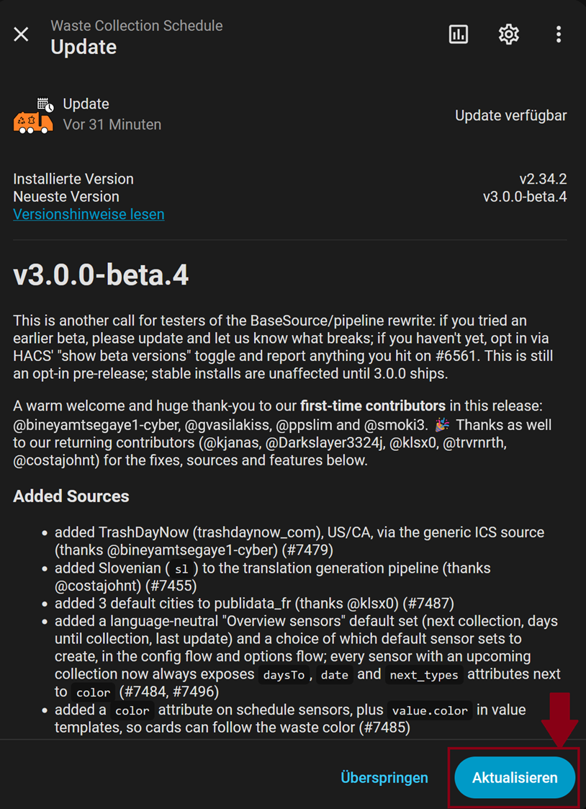

# Upgrade auf 3.0.0-alpha.1

Um das Upgrade anzustoßen:

- HA → Einstellungen → Geräte & Dienste → HACS → Waste Collection Schedule

- im Bereich `Diagnose` auf +1 `deaktivierte Entität` klicken
  
  *Abbildung: WCS--deaktivierte Entität*

- im Bereich `Diagnose` den Schalter `Pre-Release` anklicken
  
  *Abbildung: WCS--Schalter Pre-Release*

- auf das Zahnrad-Symbol klicken → die Option `aktiviert` aktivieren → auf `aktualisieren` klicken
  
  *Abbildung: Schalter des Pre-Release Sensors aktivieren*

- die Aktivierung bestätigen
  
  *Abbildung: WCS--Aktivierung des Schalters bestätigen*

- Pre-Release Sensor unter WCS aktivieren
  
  *Abbildung: WCS--Pre-Release Sensor aktivieren*

- Das Upgrade ist jetzt verfügbar
  
  *Abbildung: WCS--Pre-Update verfügbar*

- auf `Update verfügbar` klicken -> auf `Aktualisieren` klicken, um WCS abschließend auf die aktuelle Version (hier: V 3.0.0-beta4) zu bringen
  
  *Abbildung: WCS--Pre-Update verfügbar*
