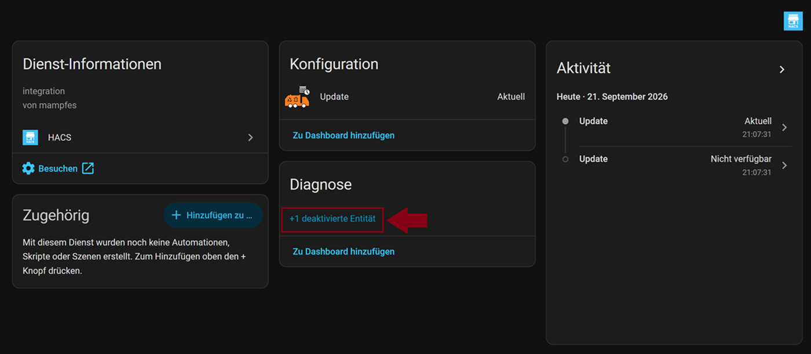

# Upgrade auf die aktuelle Version

## Das Upgrade anstoßen

- HA → Einstellungen → Geräte & Dienste → HACS → Waste Collection Schedule

- im Bereich `Diagnose` auf +1 `deaktivierte Entität` klicken  
    
  *Abbildung: WCS--deaktivierte Entität*

- im Bereich `Diagnose` den Schalter `Pre-Release` anklicken  
    
  *Abbildung: WCS--Schalter Pre-Release*

- auf das Zahnrad-Symbol klicken → die Option `aktiviert` aktivieren → auf `aktualisieren` klicken  
    
  *Abbildung: Schalter des Pre-Release Sensors aktivieren*

- die Aktivierung bestätigen
    
  *Abbildung: WCS--Aktivierung des Schalters bestätigen*

- Pre-Release Sensor unter WCS aktivieren  
    
  *Abbildung: WCS--Pre-Release Sensor aktivieren*

- Das Upgrade ist jetzt verfügbar  
    
  *Abbildung: WCS--Pre-Update verfügbar*

- auf `Update verfügbar` klicken → auf `Aktualisieren` klicken, um WCS anschließend auf die aktuelle Version (hier: V 3.0.0-beta4) zu bringen  
    
  *Abbildung: WCS--Pre-Update verfügbar*
  
- HA → Einstellungen → HA neu starten
    
  *Abbildung: HA neu starten*

    
  *Abbildung: HA-Neustart bestätigen*

  ## Fazit

  Bisher sind keinerlei Probleme mit der aktuellen Version aufgetreten. Alle Sensoren/Entitäten sind vollständig, und die Anzeigen auf dem Dashboard unverändert geblieben.
