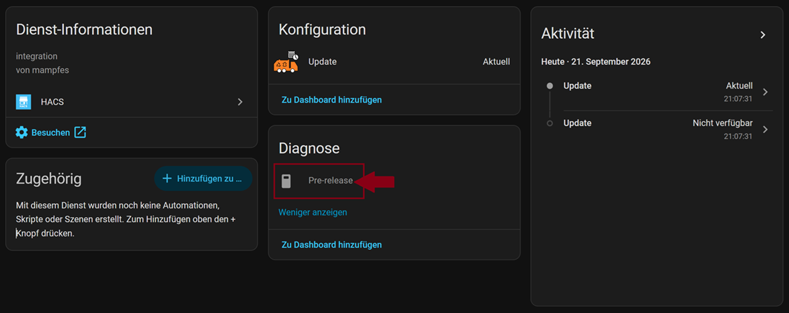
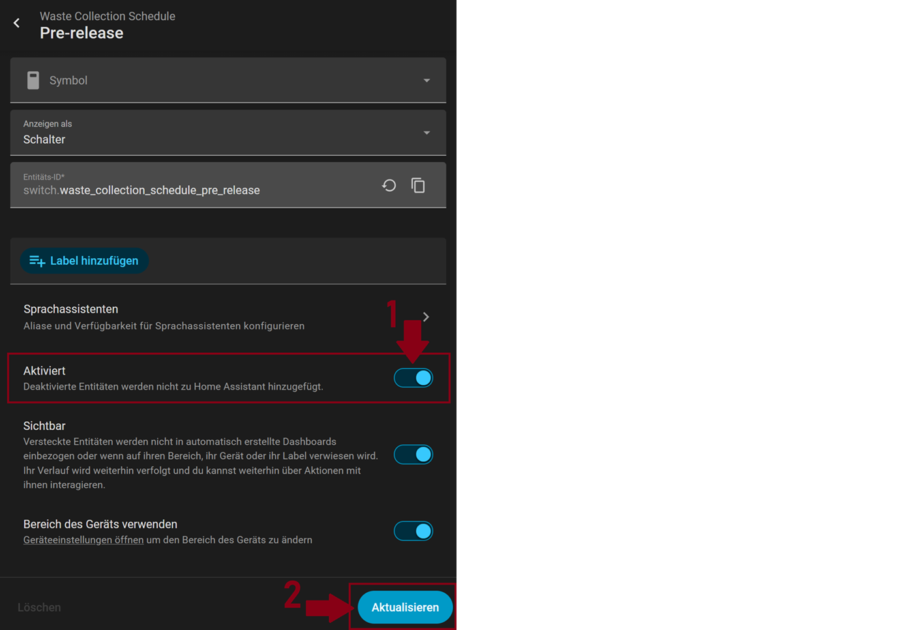
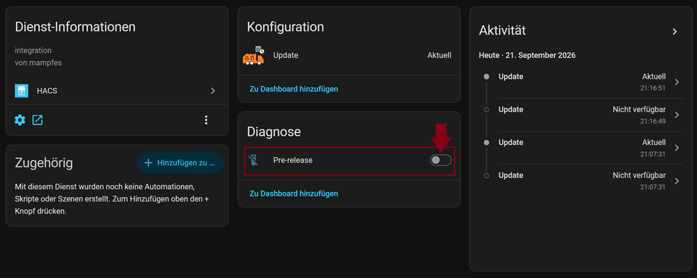
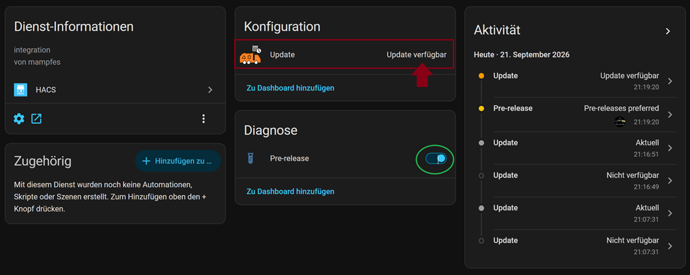
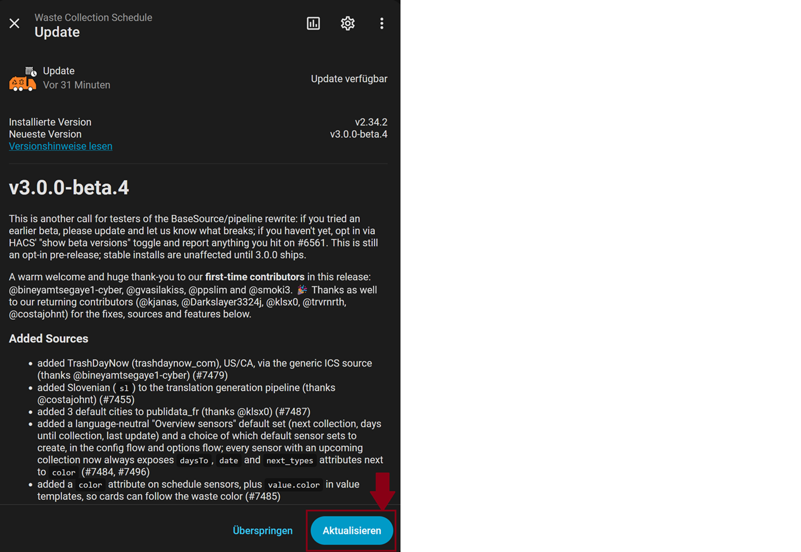
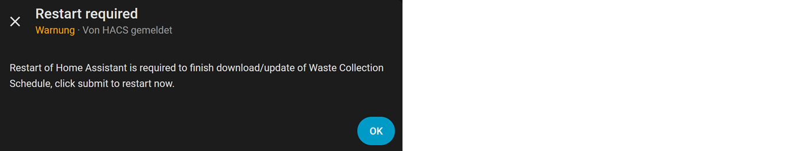

# Upgrade to the current version

To initiate the upgrade:

- HA → Settings → Devices & Services → HACS → Waste Collection Schedule

- in the `Diagnostics` area click on +1 `deactivated entity`
  
  *Image: deactivated entity*

- click on the `Pre-Release` switch in the `Diagnostics` area
  
  *Image: activate switch pre-release*

- click on the gear symbol → activate the `enabled` option → click on `update`.
  
  *Image: Activate pre-release sensor switch*

- confirm activation
  
  *Image: Confirm activation of the switch*

- Activate pre-release sensor under WCS
  
  *Image: Activate WCS pre-release sensor*

- The upgrade is now available
  
  *Image: Pre-Update is available*

- Click on `Update available` → click on `Update` to then update WCS to the current version (here: V 3.0.0-beta4).
  
  *Image: Update to the current version*

- HA → Settings → Restart HA
  
  *Image: Restart HA*

  
  *Image: Confirm HA restart*
  